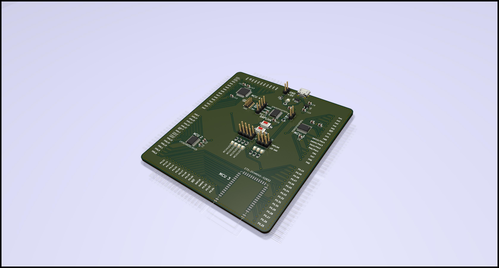

# The MOA(R)B (or mother of all Rust boards)

The MOA(R)B is a proof of concept proto board which breaks out 4 MCUs from
different vendors which are readily supported by the Rust programming language
and adds a DAP42 USB debugger/programmer with virtual serial port as well as
the requisite USB port and voltage regulator for good measure.

## What exactly is it?

The MOA(R)B was developed to demonstrate how easy it is to design and manufacture Rust-able microcontroller designs. The original plan was to give a talk about this at Oxidize 2019 but that didn't happen. The board is still the first iteration (with a minor fix applied) and I don't expect to further update it. However feel free to take the full or parts of the design and do whatever you want with it.

The following MCUs are supported (but compatible footprints might be used as well):
* ST STM32F042F6Px
* NXP LPC824M201JDH20
* EByte E73-2G4M04S-52832 (a BLE capable module based on the Nordic NRF52832)
* Atmel/Microchip ATSAMD21E15A

In addition another STM32F042F6P6 can be populated as DAPlink compatible debugger/programmer with virtual serial port.

## How to build the boards?

I've included an interactive HTML BOM and population guide [here](bom/ibom.html).

If you happen to have one of the 10 first run boards you will need to add a shame wire from pad 15 of the DAPlink MCU to ground; if you want to populate and use the onboard debugger, that is. If you build the current version 1.1; there no known errata.

### Functional blocks

* Voltage regulator: If you want to automatic 3.3V generation and distribution, this is a must have. You should also populate J5 then, which connect the 3.3V to the MCUs when the link is shorted
* USB input: You obviously want to have this if you want to power the board from USB and/or use the onboard debugger (in this case you might also want to consider populating the TVS protection diode)
* Debugger: Obviously you only need this if you'd like to have the onboard debugger. The purpose of the SWD connector and J6 is to connect the SWD lines to the onboard debugger but also for standalone conversion if you have an external debugger or you'd like to use this debugger for external devices -- so many choices!
* LEDs: Who doesn't like blinkies? The 4 MCU leds are indicators for powered MCUs the other ones can either be used for the debugger or alternatively for any of the MCUs.
* The MCUs are completely optional and fully broken so populate whichever you want. The capacitors next to the MCUs should be populated for decoupling. Most likely you also want to have the matching pins on the backside; those can either be long enough straight headers or SMD headers.

## Can I reuse the hardware for my own ideas?

Absolutely, everything is licensed under the BSD license so please go ahead and use it however you'd like.
